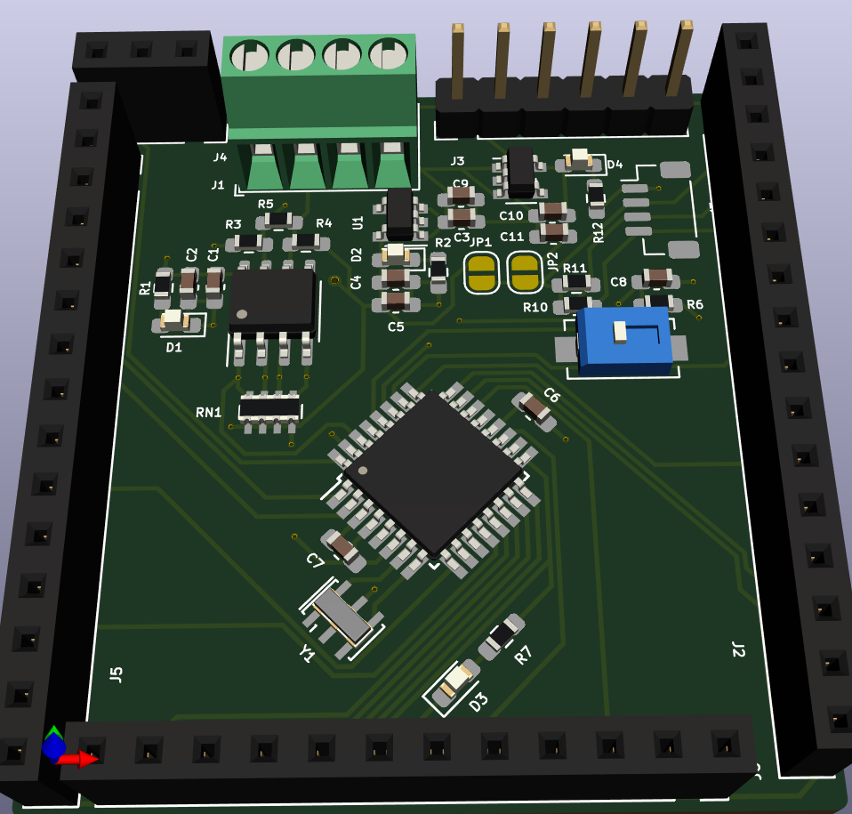

Labibus_v3

Ref: https://labitat.dk/wiki/Labibus

price components around: 12 EUR
can be cheaper in bulk

|Reference   |Quantity|Value               |Price|
|------------|--------|--------------------|-----|
|C1 C3 C4    |3       |10uF                |0.3  |
|C2 C5 C6 C7 |4       |0.1uF               |0.4  |
|D1 D2 D3    |3       |LED                 |0.3  |
|J1          |1       |Screw_Terminal_01x04|2.52 |
|J2          |1       |Conn_01x16          |0.992|
|J3          |1       |Conn_01x06          |0.372|
|J4          |1       |Conn_01x03          |0.186|
|J5          |1       |Conn_01x15          |0.93 |
|J6          |1       |Conn_01x12          |0.744|
|R1          |1       |1k                  |0.1  |
|R2 R8 R9    |3       |10k                 |0.3  |
|R3 R4       |2       |20k                 |0.2  |
|R5          |1       |120                 |0.1  |
|R6          |1       |100k                |0.1  |
|R7          |1       |300                 |0.1  |
|RN1         |1       |10k                 |0.09 |
|SW1         |1       |SW_Push             |0.123|
|U1          |1       |MIC5205-5.0YM5      |0.455|
|U2          |1       |MAX485E             |2.62 |
|U3          |1       |ATmega328P-AU       |2.21 |
|Y1          |1       |Crystal_GND2_Small  |0.245|
|            |        |                    |12.387|
